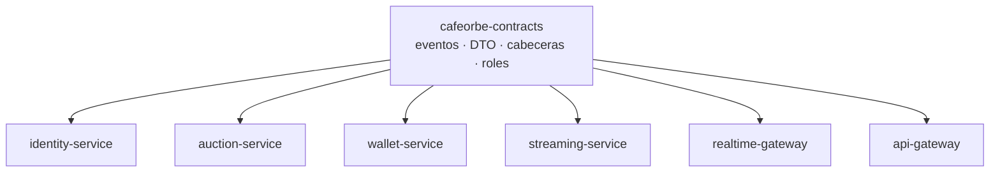
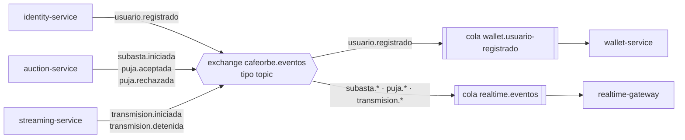
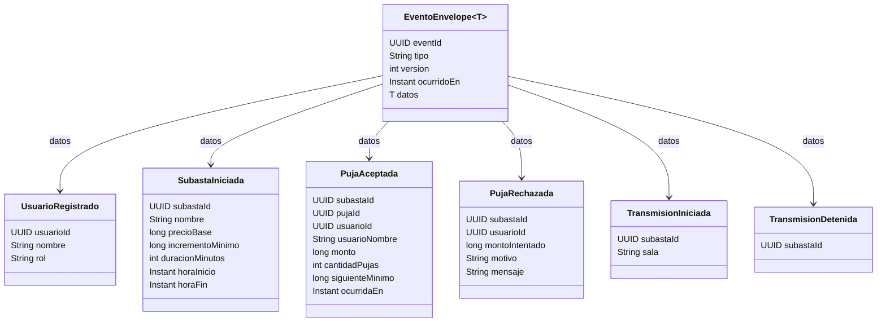
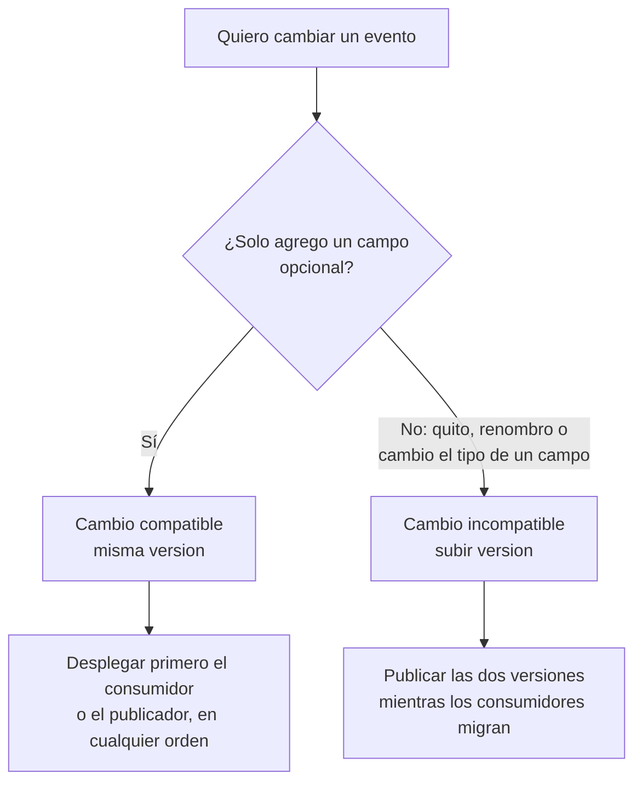
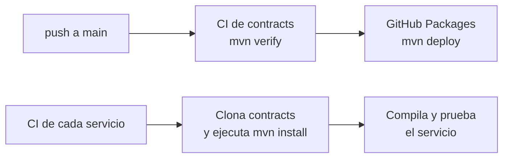

# cafeorbe-contracts

> El lenguaje común de CaféOrbe: los esquemas de los eventos, los DTO de las llamadas entre servicios y las constantes que todos deben escribir igual. No contiene lógica de negocio.

| | |
|---|---|
| **Responsabilidad** | Definir, en un solo lugar, los contratos entre servicios |
| **Tipo** | Librería Java (jar), no un servicio desplegable |
| **Stack** | Java 21 · Maven · sin dependencias externas |
| **Coordenadas** | `com.cafeorbe:cafeorbe-contracts:0.1.0-SNAPSHOT` |
| **La usan** | Los seis servicios del backend |

## Contenido

1. [Por qué existe](#1-por-qué-existe)
2. [Qué contiene](#2-qué-contiene)
3. [Mapa de eventos](#3-mapa-de-eventos)
4. [El sobre común](#4-el-sobre-común)
5. [Catálogo de eventos](#5-catálogo-de-eventos)
6. [Contratos síncronos](#6-contratos-síncronos)
7. [Reglas de evolución](#7-reglas-de-evolución)
8. [Decisiones de arquitectura](#8-decisiones-de-arquitectura)
9. [Uso y distribución](#9-uso-y-distribución)
10. [Riesgos conocidos y evolución](#10-riesgos-conocidos-y-evolución)

---

## 1. Por qué existe

En una arquitectura de microservicios cada servicio tiene su propia base y su propio código. Lo único que comparten es **lo que se dicen entre ellos**. Si cada servicio definiera por su cuenta la forma de un evento, un cambio en quien publica rompería en silencio a quien consume.

Este módulo fija esos acuerdos en código: quien publica y quien consume compilan contra la misma definición.



**Límite estricto:** aquí solo hay estructuras de datos y constantes. Nada de validaciones, utilidades ni reglas. Una librería compartida con lógica acopla a todos los servicios a su ciclo de cambios y termina siendo un monolito distribuido.

## 2. Qué contiene

```text
com.cafeorbe.contracts
├── EventoEnvelope      sobre común de todos los eventos
├── Eventos             nombre del exchange y routing keys
├── Cabeceras           nombres de las cabeceras de identidad
├── Rol                 SUBASTADOR, COMPRADOR
├── eventos/            un record por evento
│   ├── UsuarioRegistrado
│   ├── SubastaIniciada
│   ├── PujaAceptada
│   ├── PujaRechazada
│   ├── TransmisionIniciada
│   └── TransmisionDetenida
└── dto/                cuerpos de las llamadas síncronas entre servicios
    ├── PujaSolicitud
    └── SaldoDto
```

Todo son `record` de Java: inmutables y sin comportamiento.

## 3. Mapa de eventos

Todos los eventos se publican en un único exchange de tipo topic, `cafeorbe.eventos`. La routing key es el tipo del evento.



Cada consumidor declara su propia cola y elige qué routing keys le interesan. Quien publica no sabe quién escucha: agregar un consumidor nuevo no exige tocar al publicador.

## 4. El sobre común

Todo evento viaja dentro de `EventoEnvelope<T>`. Los metadatos son iguales para todos; lo que cambia es `datos`.



| Campo del sobre | Para qué sirve |
|---|---|
| `eventId` | Identificador único. Los consumidores lo usan para ser **idempotentes**: un evento repetido se reconoce y se descarta |
| `tipo` | Tipo del evento; coincide con la routing key |
| `version` | Versión del esquema de `datos`. Hoy todos están en `1` |
| `ocurridoEn` | Instante en que ocurrió el hecho, no en que se publicó |
| `datos` | La carga útil |

Ejemplo de un mensaje en el broker:

```json
{
  "eventId": "6b1f0c1e-2a57-4f0a-9d3b-0f6f2f7a9c11",
  "tipo": "puja.aceptada",
  "version": 1,
  "ocurridoEn": "2026-09-30T15:01:00Z",
  "datos": {
    "subastaId": "c2a9...", "pujaId": "91be...", "usuarioId": "0b6f...", "usuarioNombre": "Ana",
    "monto": 110, "cantidadPujas": 1, "siguienteMinimo": 120, "ocurridaEn": "2026-09-30T15:01:00Z"
  }
}
```

## 5. Catálogo de eventos

| Routing key | Record | Publica | Consume | Significado | Historias |
|---|---|---|---|---|---|
| `usuario.registrado` | `UsuarioRegistrado` | identity | wallet | Una persona ingresó por primera vez con ese nombre y rol | HU-07 |
| `subasta.iniciada` | `SubastaIniciada` | auction | realtime | El Subastador abrió la recepción de pujas | HU-12 |
| `puja.aceptada` | `PujaAceptada` | auction | realtime | Hay nuevo líder y nuevo precio | HU-13, HU-14 |
| `puja.rechazada` | `PujaRechazada` | auction | realtime | Una puja no pasó la validación; solo le interesa a quien pujó | HU-14 |
| `transmision.iniciada` | `TransmisionIniciada` | streaming | realtime | El Subastador empezó a transmitir | HU-11 |
| `transmision.detenida` | `TransmisionDetenida` | streaming | realtime | La transmisión terminó | HU-11 |

Los nombres siguen la convención `entidad.hecho`, en pasado: un evento describe algo que **ya ocurrió**, no una orden.

**Previstos para el Sprint 2:** `subasta.cerrada` (cierre, cobro y anuncio del ganador), `tiempo.extendido` (anti-sniping) y `orbes.cobrados` (refresco del saldo).

## 6. Contratos síncronos

### Cabeceras de identidad

El api-gateway valida el token y propaga la identidad a los servicios internos en estas cabeceras. `Cabeceras` evita que alguien las escriba distinto.

| Constante | Cabecera | Contenido |
|---|---|---|
| `USUARIO_ID` | `X-User-Id` | UUID del usuario |
| `USUARIO_NOMBRE` | `X-User-Name` | Nombre **codificado como URL** (UTF-8), para admitir tildes |
| `USUARIO_ROL` | `X-User-Role` | `SUBASTADOR` o `COMPRADOR` |

### DTO entre servicios

| Record | Llamada | Uso |
|---|---|---|
| `PujaSolicitud(monto)` | realtime-gateway → auction-service | Cuerpo de `POST /api/subastas/{id}/pujas` |
| `SaldoDto(usuarioId, saldo)` | auction-service → wallet-service | Respuesta de la consulta de saldo |

## 7. Reglas de evolución

Los servicios se despliegan por separado, así que en algún momento conviven un publicador nuevo y un consumidor viejo. Los cambios deben permitirlo.



| Cambio | Compatible | Qué hacer |
|---|:-:|---|
| Agregar un campo opcional | Sí | Mantener `version` |
| Agregar un evento nuevo | Sí | Nueva routing key y nuevo record |
| Quitar o renombrar un campo | No | Subir `version` y convivir con la anterior |
| Cambiar el tipo o el significado de un campo | No | Subir `version` y convivir con la anterior |

Un consumidor debe **ignorar los campos que no conoce** y los eventos cuyo tipo no maneja.

## 8. Decisiones de arquitectura

| Decisión | Motivo | Costo aceptado |
|---|---|---|
| Librería compartida solo con contratos | Publicador y consumidor compilan contra la misma definición: un cambio incompatible falla al compilar, no en producción | Los servicios comparten una dependencia |
| Sin lógica ni dependencias externas | La librería no arrastra versiones de frameworks ni reglas a los servicios | Cada servicio hace su propia validación |
| Sobre común con `eventId` | La idempotencia y la trazabilidad se resuelven igual para todos los eventos | Unos bytes más por mensaje |
| Eventos en pasado, con los datos necesarios | El consumidor no necesita volver a preguntar al publicador para actuar | Eventos algo más grandes |
| El rol viaja como texto en `UsuarioRegistrado` | El contrato del evento no depende de una enumeración de Java | El consumidor compara cadenas |
| Montos como enteros (`long`) | Los Orbes no tienen decimales; no hay errores de redondeo | |

## 9. Uso y distribución

Requiere **Java 21** (el build falla con otra versión).

```bash
mvn install          # compila y deja el jar en el repositorio Maven local (~/.m2)
```

Hay que ejecutarlo **antes** de compilar cualquier servicio. Cada servicio lo declara así:

```xml
<dependency>
    <groupId>com.cafeorbe</groupId>
    <artifactId>cafeorbe-contracts</artifactId>
    <version>0.1.0-SNAPSHOT</version>
</dependency>
```



El pipeline de este repositorio publica el jar en GitHub Packages. Los pipelines de los servicios, en cambio, **clonan este repositorio y lo compilan** en cada ejecución.

## 10. Riesgos conocidos y evolución

| Riesgo o deuda | Impacto | Acción propuesta |
|---|---|---|
| Los servicios compilan contra el último commit de `main` | Un cambio aquí afecta al siguiente build de todos los servicios, sin que ellos lo hayan pedido. Los builds no son reproducibles | Versiones fijas publicadas (`0.1.0`, `0.2.0`) y que cada servicio elija cuándo actualizar |
| Versión `SNAPSHOT` permanente | No se puede saber con qué contrato se compiló un servicio desplegado | Versionado semántico con etiquetas |
| El jar publicado en GitHub Packages no se usa | Dos mecanismos de distribución; solo uno está en uso | Consumir el paquete publicado y dejar de clonar |
| Sin pruebas de contrato | Nada verifica que un consumidor siga entendiendo lo que el publicador envía | Pruebas de serialización por evento, o pruebas de contrato dirigidas por el consumidor |
| Acoplamiento a Java | Un servicio en otro lenguaje tendría que reescribir los contratos | Esquemas neutrales (JSON Schema o AsyncAPI) como fuente, y generar los records |
